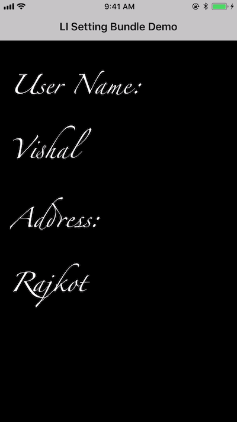
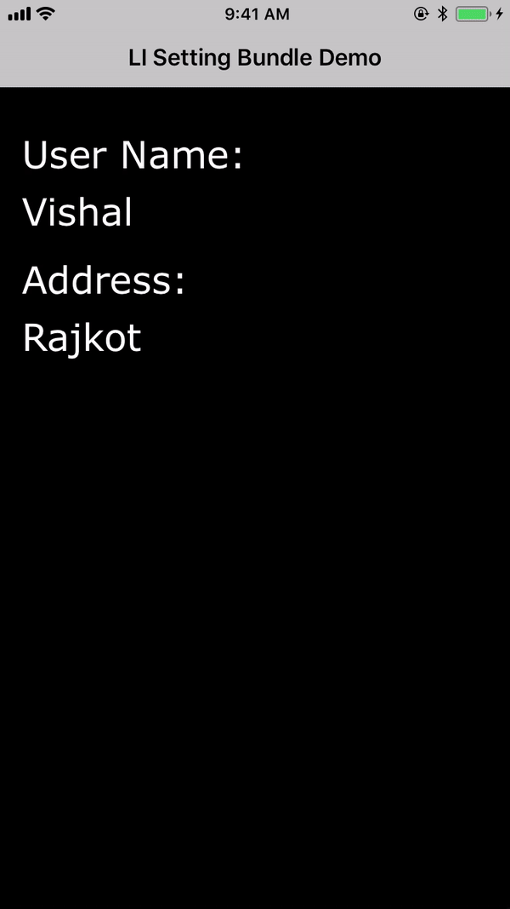

# iOSSettingBundle

[This blog](https://www.logisticinfotech.com/blog/setting-bundle-ios-application/) explains how to use Setting Bundle in iOS Application with All Components. 

# Preview
   

    
